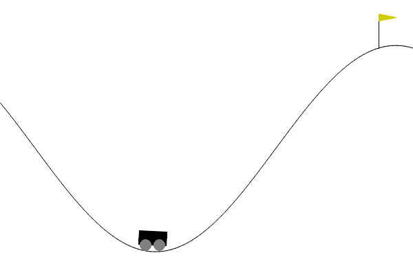
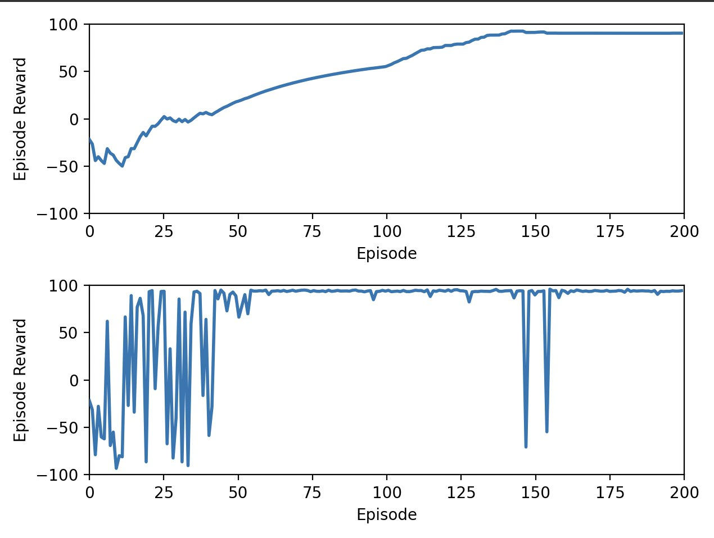

# DDPG Algorithm for Solving MountainCarContinuous 🚗💨

> An implementation of the **Deep Deterministic Policy Gradient (DDPG)** algorithm using **Keras/TensorFlow** to solve the OpenAI Gym environment **MountainCarContinuous-v0**.

---

## 📋 Project Description

This project demonstrates the use of the **DDPG algorithm**, based on deep neural networks, to control a car on a complex inclined track. The goal of the agent is to develop a strategy that allows it to overcome the incline with minimal effort.

The program:
- **Trains a DDPG agent** to effectively learn optimal policies.
- **Saves data** (rewards and running average over 200 episodes) in a Pickle dump file.
- Includes a `plotter.py` utility to process the saved data and generate **graphs** and **animated plots**.

---

## 🛠️ Technologies Used

- **Python** 🐍
- **Keras/TensorFlow** 🧠
- **OpenAI Gym** 🏋️
- **Numpy** 📐
- **Matplotlib** 📊

